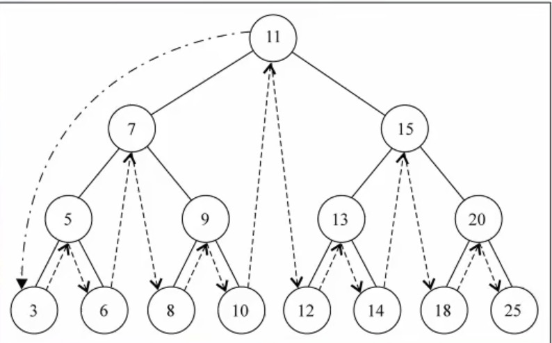

## 1.二叉树
二叉树：n(n>=0)个结点的有限集合，该集合或者为空集（称为空二叉树），或者由一个根结点和两棵互不相交的、分别称为根结点的左子树和右子树组成
>特点：  
>1.每个结点最多有两颗子树，所以二叉树中不存在度大于2的结点  
>2.左子树和右子树是有顺序的，次序不能任意颠倒  
>3.即使树中某结点只有一棵子树，也要区分它是左子树还是右子树 

## 2.二叉树性质
1.在二叉树的第i层上最多有2^(i-1) 个节点 （i>=1）  
2.二叉树中如果深度为k,那么最多有2^k-1个节点(k>=1）  
3.n0=n2+1 n0表示度数为0的节点数，n2表示度数为2的节点数   

## 3.满二叉树（完美二叉树）
满二叉树：在一棵二叉树中如果所有分支结点都存在左子树和右子树，并且所有叶子都在同一层上
>特点：  
>1.叶子只能出现在最下一层出现在其它层就不可能达成平衡  
>2.非叶子结点的度一定是2  
>3.在同样深度的二叉树中，满二叉树的结点个数最多，叶子数最多  

## 4.完全二叉树
完全二叉树：对一颗具有n个结点的二叉树按层编号，如果编号为i(1<=i<=n)的结点与同样深度的满二叉树中编号为i的结点在二叉树中位置完全相同
>特点：  
>1.叶子结点只能出现在最下层和次下层  
>2.最下层的叶子结点集中在树的左部  
>3.倒数第二层若存在叶子结点，一定在右部连续位置  
>4.如果结点度为1，则该结点只有左孩子，即没有右子树  
>5.同样结点数目的二叉树，完全二叉树深度最小  
:::tip
满二叉树一定是完全二叉树，但反过来不一定成立
:::

## 5.二叉搜索树
二叉查找树 BST（Binary Search Tree），也称二叉搜索树、有序二叉树，排序二叉树
>特点：  
>1.若任意节点的左子树不空，则左子树上所有结点的值均小于它的根结点的值  
>2.任意节点的右子树不空，则右子树上所有结点的值均大于它的根结点的值  
>3.任意节点的左、右子树也分别为二叉查找树  
>4.没有键值相等的节点（no duplicate nodes）  

## 6.二叉搜索树的一些方法
`insert(key)`  ：向BST插入元素    
`preOrderTraversal(function)`： 先序遍历,无参数默认返回key的数组  
 
`midOrderTraversal(function)`： 中序遍历,无参数默认返回key的数组（key升序） 
   
`postOrderTraversal(function)`： 后序遍历,无参数默认返回key的数组  
  
`remove(key)`  ：从BST删除元素  
>1.没有子节点的情况下  
>2.左节点为空，右节点有值  
>3.右节点为空，左节点有值  
>4.被删除的节点既有左子树而且又有右子树 
## 7.二叉搜索树代码实现
```js
function isEmpty(val) {
    return val === undefined || val === null
}
class Node {
    constructor(key) {
        this.left = null
        this.right = null
        this.key = key
    }
}
class BinarySearchTree {
    constructor() {
        this.root = null
    }
    // 插入方法
    insert(key) {
        let newNode = new Node(key)
        if (this.root) {
            // 递归方法实现
            // this.insertNode(this.root, newNode)
            // 循环方法实现
            let current = this.root
            while (true) {
                if (key < current.key) {
                    if (isEmpty(current.left)) {
                        current.left = newNode
                        return
                    }
                    current = current.left
                } else {
                    if (isEmpty(current.right)) {
                        current.right = newNode
                        return
                    }
                    current = current.right
                }
            }
        } else {
            this.root = newNode
        }
    }
    // 插入的递归方法
    insertNode(node, newNode) {
        if (newNode.key < node.key) {
            if (isEmpty(node.left)) {
                node.left = newNode
            } else {
                this.insertNode(node.left, newNode)
            }
            node = node.left
        } else {
            if (isEmpty(node.right)) {
                node.right = newNode
            } else {
                this.insertNode(node.right, newNode)
            }
        }
    }
    // 先序遍历 先访问根节点(root)  -> 左子节点(left-child) -> 右子节点(right-child)
    preOrderTraversal(handel) {
        let res = []
        // 如果没有传入函数，则默认返回一个key的数组
        if (typeof handel !== 'function') {
            handel = (key) => {
                res.push(key)
            }
        }
        this.preOrderTraversalNode(this.root, handel)
        return res
    }
    // 先序遍历递归函数
    preOrderTraversalNode(node, handle) {
        if (!isEmpty(node)) {
            handle(node.key)
            this.preOrderTraversalNode(node.left, handle)
            this.preOrderTraversalNode(node.right, handle)
        }
    }
    // 中序遍历 先访问左子节点(left-child) -> 根节点(root) -> 右子节点(right-child)
    midOrderTraversal(handel) {
        let res = []
        // 如果没有传入函数，则默认返回一个key的数组
        if (typeof handel !== 'function') {
            handel = (key) => {
                res.push(key)
            }
        }
        this.midOrderTraversalNode(this.root, handel)
        return res
    }
    // 中序遍历递归函数
    midOrderTraversalNode(node, handle) {
        if (!isEmpty(node)) {
            this.midOrderTraversalNode(node.left, handle)
            handle(node.key)
            this.midOrderTraversalNode(node.right, handle)
        }
    }
    // 后序遍历 先访问左子节点(left-child) -> 右子节点(right-child) -> 根节点(root)
    postOrderTraversal(handel) {
        let res = []
        // 如果没有传入函数，则默认返回一个key的数组
        if (typeof handel !== 'function') {
            handel = (key) => {
                res.push(key)
            }
        }
        this.postOrderTraversalNode(this.root, handel)
        return res
    }
    // 后序遍历递归函数
    postOrderTraversalNode(node, handle) {
        if (!isEmpty(node)) {
            this.postOrderTraversalNode(node.left, handle)
            this.postOrderTraversalNode(node.right, handle)
            handle(node.key)
        }
    }
    // 最大值
    max() {
        return this._getValue('right')
    }
    // 最小值
    min() {
        return this._getValue('left')
    }
    _getValue(arrow) {
        if (isEmpty(this.root)) {
            return null
        }
        let key = ''
        let current = this.root
        while (!isEmpty(current)) {
            key = current.key
            current = current[arrow]
        }
        return key
    }
    // 搜索树种的key
    search(key) {
        let current = this.root
        while (current) {
            if (key < current.key) {
                current = current.left
            } else if (key > current.key) {
                current = current.right
            } else {
                return true
            }
        }
        return false
    }
    // 删除
    remove(key) {
        if (isEmpty(this.root)) {
            return false
        }
        let current = this.root
        let parent = null
        let isLeftChild = true
        // 找到节点
        while (current.key !== key) {
            parent = current
            if (key < current.key) {
                current = current.left
                isLeftChild = true
            } else if (key > current.key) {
                current = current.right
                isLeftChild = false
            }
            if (isEmpty(current)) {
                return false
            }
        }
        // 1.没有子节点的情况下
        if (isEmpty(current.left) && isEmpty(current.right)) {
            if (current === this.root) {
                this.root = null
            } else {
                if (isLeftChild) {
                    parent.left = null
                } else {
                    parent.right = null
                }
            }
        } else if (isEmpty(current.left)) {
            // 2.左节点为空，右节点有值
            if (current === this.root) {
                this.root = current.right
            }
            if (isLeftChild) {
                parent.left = current.right
            } else {
                parent.right = current.right
            }
        } else if (isEmpty(current.right)) {
            // 3.右节点为空，左节点有值
            if (current === this.root) {
                this.root = current.left
            }
            if (isLeftChild) {
                parent.left = current.left
            } else {
                parent.right = current.left
            }
        } else {
            // 被删除的节点既有左子树而且又有右子树
            // 前驱：比删除节点大一点点的，即左子树的最大值
            // 后继：比删除节点小一点点的，即右子树的最小值
            let successor = this._getSuccessor(current)
            successor.left = current.left
            if (this.root === current) {
                this.root = successor
            } else if (isLeftChild) {
                parent.left = successor
            } else {
                parent.right = successor
            }
        }
        return true
    }
    // 后继
    _getSuccessor(delNode) {
        let successor = delNode
        let parentSuccessor = delNode
        let current = delNode.right
        // 寻找节点
        while (current) {
            parentSuccessor = successor
            successor = current
            current = current.left
        }
        // 如果后继节点不是删除节点的右节点
        if (successor !== delNode.right) {
            parentSuccessor.left = successor.right
            successor.right = delNode.right
        }
        return successor
    }
}
let bst = new BinarySearchTree()
bst.insert(11)
bst.insert(7)
bst.insert(15)
bst.insert(5)
bst.insert(3)
bst.insert(9)
bst.insert(8)
bst.insert(10)
bst.insert(13)
bst.insert(12)
bst.insert(14)
bst.insert(20)
bst.insert(18)
bst.insert(25)
bst.insert(6)
bst.preOrderTraversal()
console.log(bst.preOrderTraversal()) //[ 11, 7, 5, 3, 6, 9, 8, 10, 15, 13, 12, 14, 20, 18, 25]
console.log(bst.midOrderTraversal()) // [3, 5, 6, 7, 8, 9, 10, 11, 12, 13, 14, 15, 18, 20, 25)]
console.log(bst.postOrderTraversal()) // [3, 6, 5, 8, 10, 9, 7, 12, 14, 13, 18, 25, 20, 15, 11]
console.log(bst.min())
console.log(bst.max())
console.log(bst.search(6))
console.log(bst.search(13))
console.log(bst.search(16))
console.log(bst.remove(11))
console.log(bst.preOrderTraversal()) //[ 12, 7, 5, 3, 6, 9, 8, 10, 15, 13, 14, 20, 18, 25]
```