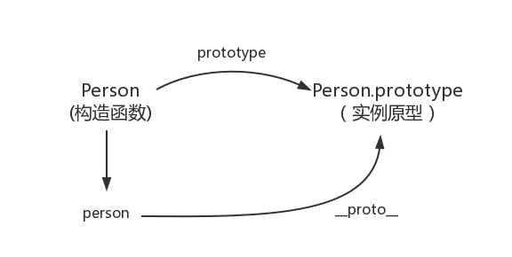

## 1.构造函数创建对象

```js
function Person() {}
let person = new Person()
person.name = 'linbin'
console.log(person.name) // linbin
```

## 2.prototype
问：我们经常会在各种例子中看见prototype这个属性，那么什么东西才会具有这个属性，这个属性又指向什么呢？  
答：prototype是函数才会有的属性，函数的 prototype 属性指向了一个对象，这个对象正是调用该构造函数而创建的实例的原型

## 3.原型
每一个JavaScript对象(null除外)在创建的时候就会与之关联另一个对象，这个对象就是我们所说的原型，每一个对象都会从原型"继承"属性  


## 4.\_\_proto\_\_
__proto__是每一个JavaScript对象(除了 null )都具有的一个属性，这个属性会指向该对象的原型，可以理解为Object.getPrototypeOf(obj)  
例子：（火狐或者谷歌中）
```js
function Person() {

}
var person = new Person();
console.log(person.__proto__ === Person.prototype); // true
```


## 5.constructor
constructor，每个原型都有一个 constructor 属性指向关联的构造函数。

```js
function Person() {

}
console.log(Person === Person.prototype.constructor); // true
```
## 6.关系总结
```js
function Person() {

}
var person = new Person();
console.log(person.__proto__ == Person.prototype) // true
console.log(Person.prototype.constructor == Person) // true
```

## 7.实例与原型
当读取实例的属性时，如果找不到，就会查找与对象关联的原型中的属性，如果还查不到，就去找原型的原型，一直找到最顶层为止
```js
function Person() {

}

Person.prototype.name = 'linbin';

var person = new Person();

person.name = 'aaa';
console.log(person.name) // aaa

delete person.name;
console.log(person.name) // linbin
```
## 8.原型的原型
原型对象就是通过 Object 构造函数生成的
Object.prototype 的原型是null等于没有原型
```js
console.log(Object.prototype.__proto__ === null) // true
```

## 9.原型链
原型组成的链状结构就是原型链，也就是蓝色的线


>参考资料<https://github.com/mqyqingfeng/Blog/issues/2>